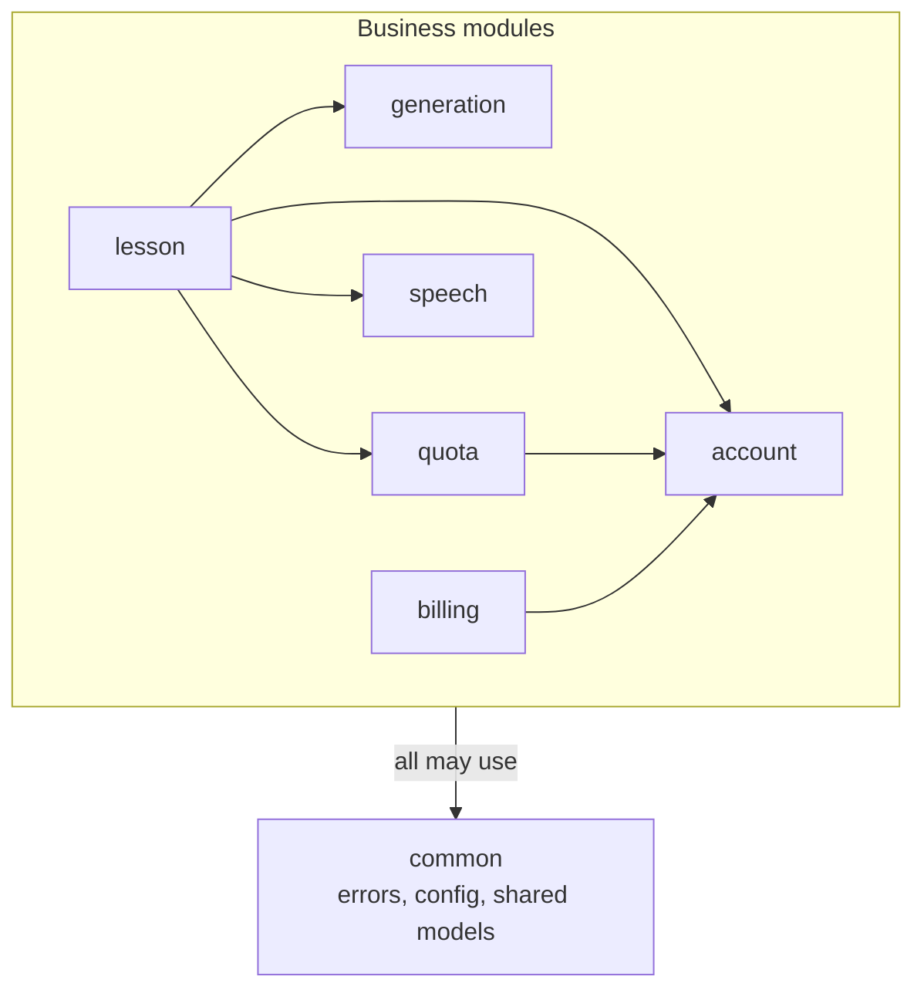

# PrepAI backend: architecture at a glance

PrepAI is an AI whiteboard tutor for Indian students (JEE, NEET, boards). A student asks a problem; the backend produces a validated lesson that the Angular app draws step by step on a whiteboard while a voice narrates it. The full product spec is `../prepai-spec.md`. This page is the map: read it first, then the `MODULE.md` of the module you are about to touch.

## Modules
The code is organised by what it does, under `src/main/java/com/ascorp/prepai/`.

| Module | What it is for | Features inside | Built by |
|--------|----------------|-----------------|----------|
| [`account`](src/main/java/com/ascorp/prepai/account/MODULE.md) | Who the student is: sign-up, login, tokens, profile, consent, deletion | `auth`, `user`, `privacy` | Agent 2 |
| [`quota`](src/main/java/com/ascorp/prepai/quota/MODULE.md) | What the student may do today: plan limits, session counting | `ratelimit`, `usage` | Agent 2 |
| [`generation`](src/main/java/com/ascorp/prepai/generation/MODULE.md) | Problem in, validated lesson out (LLM, validation, caches, image reading) | `llm`, `validation`, `rag`, `embedding`, `cache`, `imageextract` | Agent 3 |
| [`lesson`](src/main/java/com/ascorp/prepai/lesson/MODULE.md) | The lesson API: generate, history, feedback, mastery check | `lesson` | Agent 4 |
| [`billing`](src/main/java/com/ascorp/prepai/billing/MODULE.md) | Paid plans through Razorpay | `subscription` | Agent 4 |
| [`speech`](src/main/java/com/ascorp/prepai/speech/MODULE.md) | Narration audio and its cache | `tts` | Agent 4 |
| [`common`](src/main/java/com/ascorp/prepai/common/MODULE.md) | Shared errors, configuration and models | `errors`, `config`, `model` | Agents 1, 2, 3 |

## How a request flows
A lesson request enters `lesson`, which asks `account` if the student may generate, asks `quota` to reserve a session, asks `generation` for the lesson, stores it, commits the session and asks `speech` to prepare the audio. The flow is drawn in the spec (section 2.6).

## Rules every change follows
- **Structure:** feature packages with `controller` → `service` → `repository` → `model`; modules call each other's services only; entities and repositories stay private to their module (spec 9.1.1).
- **Quality:** story-style methods of at most 20 lines, SOLID, constructor injection (spec 9.1.2).
- Both are enforced by `./gradlew check` (Checkstyle, ArchUnit, tests, coverage), so a change that breaks them cannot be merged.

## Data ownership
| Module | Tables | Redis keys |
|--------|--------|------------|
| `account` | `users`, `refresh_tokens`, `verification_tokens` | `signup:{ip}:{hour}` |
| `quota` | `usage_log` | `ratelimit:*` |
| `generation` | `problem_embeddings`, `quality_corrections` | `lesson:cache:*` |
| `lesson` | `lessons` | none |
| `billing` | `subscriptions` | none |
| `speech` | none (audio files in `AUDIO_DIR`) | none |

## Repository layout
| Path | What is there |
|------|---------------|
| `prepai/` (this folder) | The Spring Boot 4.1.1 / Java 21 / Gradle backend |
| `prepai/src/main/resources/` | `application.yaml`, `application-local.yml`, `application-prod.yml`, Flyway migrations in `db/migration` |
| `prepai/config/checkstyle/` | The code-quality limits |
| `frontend/` | Angular app, current stable `ng new` (created by Agent 1) |
| `scripts/`, `nginx/`, `ops/` | VPS setup, deployment, reverse proxy, monitoring (Agents 1 and 9) |

## Everyday commands
- `./gradlew bootRun` starts the app with the `local` profile on port 8085 (needs PostgreSQL 17 + pgvector and Redis 8; see spec 2.5).
- `./gradlew check` runs Checkstyle, the architecture tests, the unit tests and the coverage check.
- Production starts with `SPRING_PROFILES_ACTIVE=prod` and secrets from the environment (spec 10.4).

## Who built what
Agent assignment is a build-time detail, kept only in the table above and in each module's "Built by" line. The agent task cards are in spec section 9.2; the build order is in 14.2. Tests are described in `src/test/java/com/ascorp/prepai/TESTING.md`.
